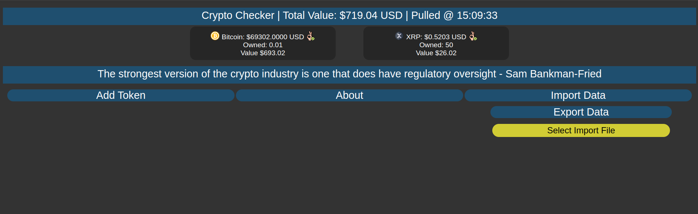
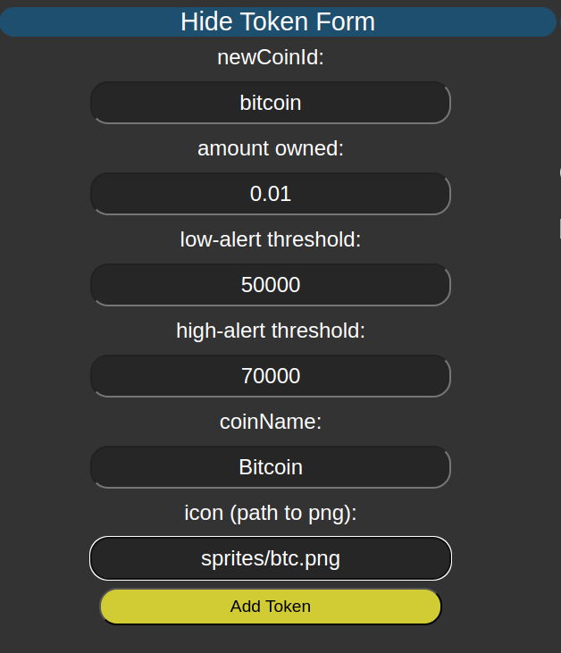

# Crypto Price Tracker - 2024 V 1.0

<p align="center">

</p>

## Description

A one-screen tracker made w/ VanillaJS to see the current status of all the coins you're interested in (probably own) at the moment. 

Of course, various tools exist, but I wanted something that bypasses all their complexity and just shows me what I want to see, quickly and efficiently.

Please refer to the proper documentation for the CoinGecko API for more information. 

I've included a sample JSON file to get you started.

I've also included the JSON data file including most (as of the date pulled) token ids, names and their respective symbols.

You need the token id, NOT SYMBOL, to add a coin to your custom list. You can choose an arbitrary name for the coin. 

### Sample Data format
```
{"coins" : [
	{
		"id": "bitcoin",
		"amountOwned": "0.01",
		"alertThresholdLower": "50000",
		"alertThresholdHigher": "70000",
		"currentPrice": 69250,
		"name": "Bitcoin",
		"icon": "sprites/btc.png"
	},
	{
		"id": "ripple",
		"amountOwned": "50",
		"alertThresholdLower": "0.4",
		"alertThresholdHigher": "0.75",
		"currentPrice": 0.520419,
		"name": "XRP",
		"icon": "sprites/xrp.png"
	}
]}
```

### Adding a new coin

<p align="center">

</p>

## Features
- Export/Import your coins list as formatted JSON
- Add new coins to the list via a form 
- Updates every 15 seconds to stay within the free CoinGecko API limits
- Shows current price for selected coins in USD
- Can specify the amount of coins you own to see their total value
- Shows the total value of all your coins (in USD only at the moment) 
- Can specify a lower and upper threshold for each coin as an alert (color coded)

## Future Features?
- Better support for other currencies 
- Move it to be hosted as opposed to running it locally 
- Better coin support for ease of use 
- mobile support? (currently not optimized for mobile viewing in any way)


